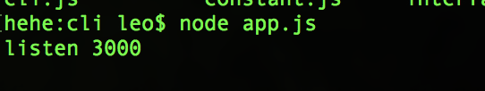
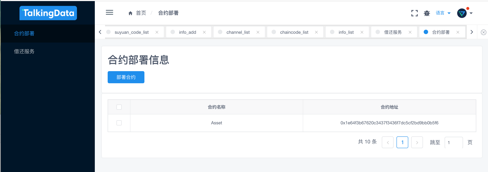
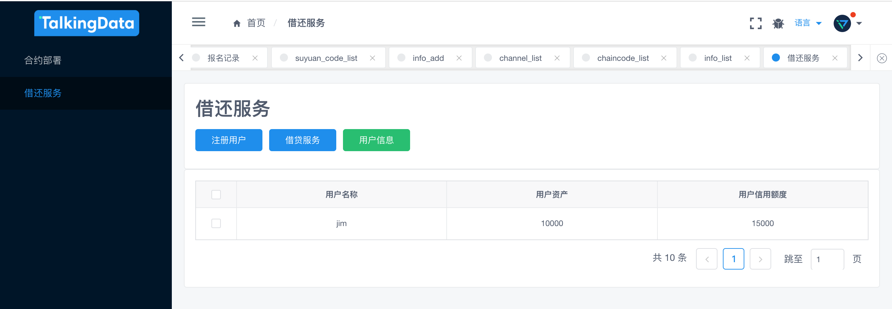

#### 这个仓库是郑子彬老师所教区块链课程大作业使用

整个项目分两个部分：

- 服务端：server文件夹，使用nodejs sdk实现后端
- 前端：web-front文件夹，使用iview admin模版完成

接下来

- 按照 [官网教程](https://fisco-bcos-documentation.readthedocs.io/zh_CN/latest/docs/sdk/nodejs_sdk/install.html) 学习安装nodejs sdk

- 进入server（我自己下载的nodejs sdk），**按照官网的指导，将证书配置路径进行修改**。接下来在server文件夹下执行：

  ```
  npm config set registry https://registry.npm.taobao.org	//替换为淘宝镜像，速度快
  
  //下载依赖
  npm install
  npm run repoclean
  npm run bootstrap
  ```

- 接下来进入clis文件夹，运行指令

  ```
  node app.js
  ```

  来开启后端，结果如下：

  

- 进入web-front文件夹

  运行指令

  ```
  cnpm install 或者 npm install 	//建议使用cnpm，速度很快
  cnpm run dev 或者 npm run dev		//这两个区别不大
  ```

  成功运行后，打开浏览器`localhost:8080`即可查看页面情况

  

  


#### 对于前端按钮的说明

- 合约部署页面

  当该页面被加载时，就会调用一个部署名为"Asset"的合约。

  同时点击合约部署，支持使用合约的名字来部署合约

- 借还服务

  注册用户，就是通过名字来注册，其中用户有两个值：资产、信用

- 借贷服务

  两个用户之间使用信用进行物品交易，转移的是信用

  用户信息，输入用户的名称即可查询相关用户信息，并且在表格中刷新或者展示